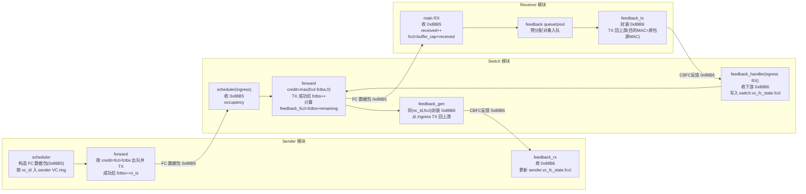
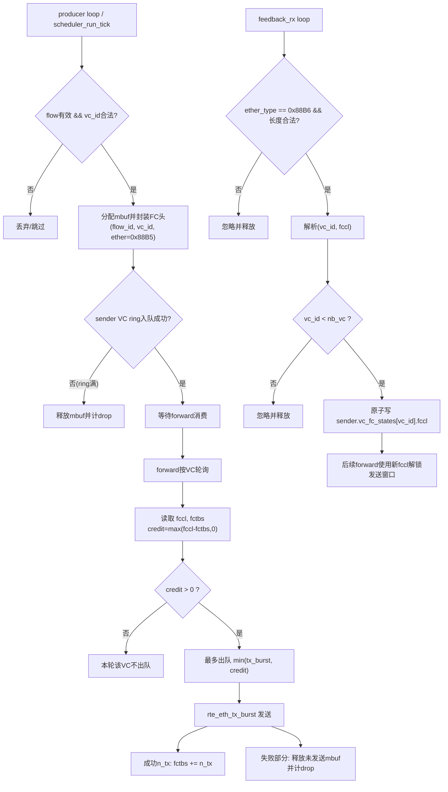
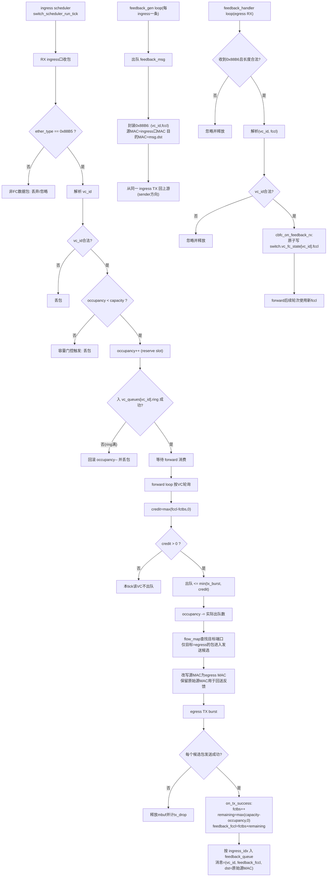
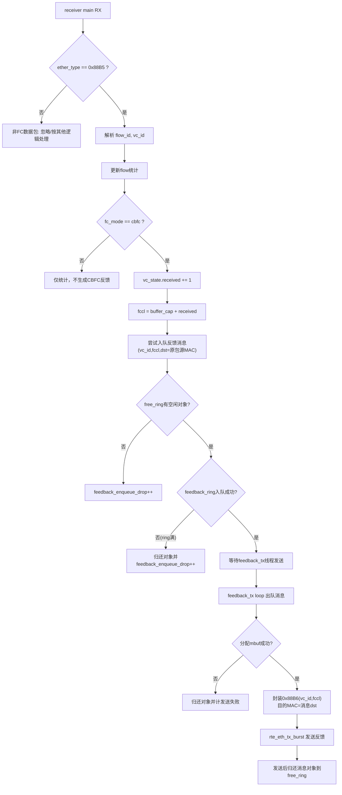
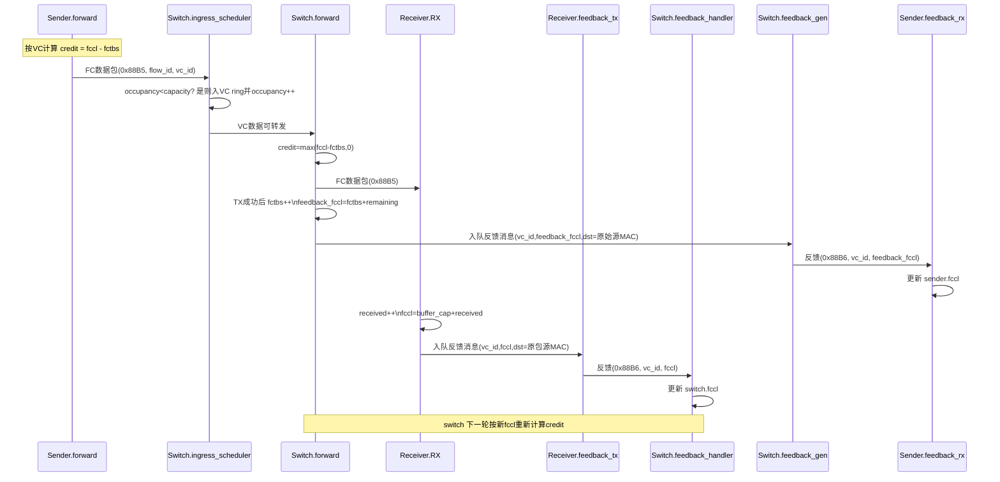
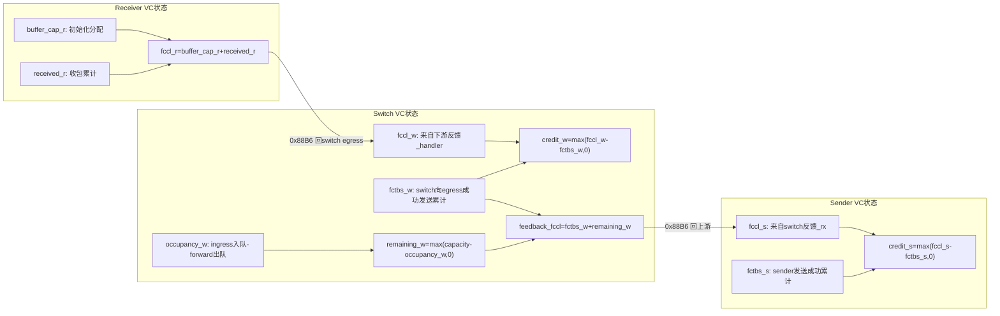

# CBFC 各模块 Mermaid 详细流程图

本文将 CBFC（Credit-Based Flow Control）在 `sender / switch / receiver` 三侧的实现，拆成可直接渲染的 Mermaid 图，重点覆盖：

- CBFC 流控信息（`fccl / fctbs / occupancy / capacity`）如何更新
- 数据包与反馈包如何在模块间传递
- 各关键分支（credit 不足、队列满、发送失败）如何处理

---

## 1) 模块级总览（数据与反馈双通道）

---

## 2) Sender 详细流程（生产、门控、反馈更新）

---

## 3) Switch 详细流程（入向缓存、出向信用、双向反馈）

---

## 4) Receiver 详细流程（累计上界生成与异步反馈发送）

---

## 5) 端到端时序图（含 CBFC 信息闭环）

---

## 6) 关键状态量关系图（便于排障）

以上图可作为 CBFC 联调时的“对照图”：

- 若 sender 长期 `credit_s=0`，优先检查 `Sender.feedback_rx` 是否收到 switch 回传；
- 若 switch 长期 `credit_w=0`，优先检查 `Switch.feedback_handler` 是否收到 receiver/下游反馈；
- 若 receiver `feedback_enqueue_drop` 升高，说明反馈路径拥塞，sender/switch 看到的 `fccl` 可能滞后。
